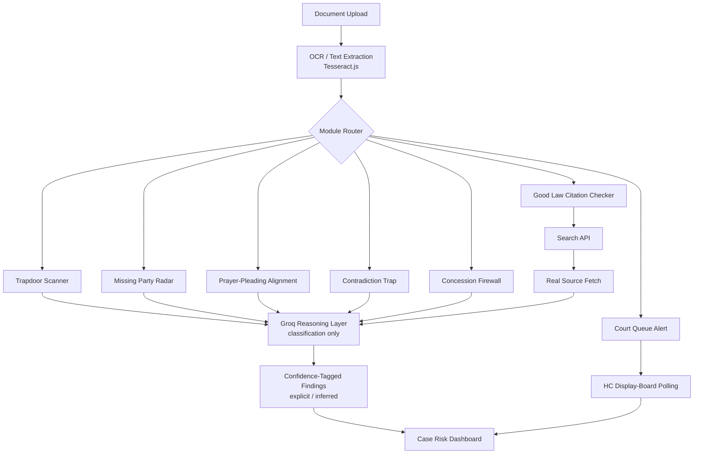
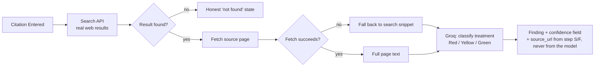

 # Advinet — Litigation Forensic Audit Platform

**Seven forensic modules that stress-test a case file before your opponent does.**

Built for the ILTN Vibeathon 2026 by Tej Talin Dandlamudi

Live: [advinet.vercel.app](https://advinet.vercel.app) · Repo: [github.com/TejTalin/Litigation-Forensics](https://github.com/TejTalin/Litigation-Forensics)

---

## The Problem

Litigation practice generates an enormous volume of correspondence, pleadings, and filings — and lawyers read them one document at a time, under deadline pressure. A concession made in a without-prejudice letter three months ago. A necessary party never joined. A prayer clause that doesn't match the grounds pleaded. A contradiction between what was said in the plaint and what a document later filed by the same party actually shows. None of these are hard to spot individually — they are hard to spot *across* a growing case file, read sequentially, by a human under time pressure.

Existing legal-tech tools in this space largely optimize for research speed — finding case law faster, drafting faster, tracking deadlines. **Advinet is built to answer a different question: does this case file, as it currently stands, create its own risk?** It treats a litigant's documents as one connected logical system and looks for what a hurried human reading them one at a time is structurally likely to miss.

## What It Does

Advinet runs seven independent forensic modules over uploaded case documents:

1. **Trapdoor Scanner** — reads correspondence for admissions, waivers, privilege breaks, and limitation-period extensions, with thread-level analysis across multi-message chains.
2. **Missing Party Radar** — flags necessary parties absent from the cause title under Order 1 Rules 9–10 CPC, distinguishing necessary from merely proper parties.
3. **Prayer-Pleading Alignment Scanner** — cross-checks pleaded grounds against the prayer clause for doctrinally established missing companion reliefs (e.g., fraud pleaded without rescission sought).
4. **Contradiction Trap** — finds factual contradictions across a party's own filings and supporting exhibits.
5. **Concession Firewall** — a live, pre-indexed checker that tells a lawyer, before they say something in a hearing or draft, whether it would be reversible, difficult to reverse, or binding against their own case.
6. **Good Law Citation Checker** — verifies whether a cited authority has been overruled, distinguished, or otherwise adversely treated by subsequent judgments, grounded in real retrieved sources rather than a bare model query.
7. **Court Queue Alert** — live polling of High Court display-board data to estimate when a matter is likely to be called.

## Engineering Philosophy

The four rules every module was built against, without exception:

- **Never invent a fact, citation, or holding.** If something can't be verified from the record or a real retrieved source, the module says so explicitly rather than filling the gap.
- **Silence is a valid, correct output.** A module that flags nothing when there is nothing to flag is working correctly. Calibration was treated as more important than recall throughout — several early iterations were rejected specifically for over-flagging.
- **Every flag is traceable.** A finding without a document, page, or paragraph reference — or, for the citation checker, a real source URL — is not a finding.
- **Fail loudly, never silently.** If an upstream data source is unavailable, a module returns a clear, honest error state. It never quietly returns an empty result that looks identical to "nothing found."

This shaped real architectural decisions. The citation checker, for instance, does not ask a language model "is this case still good law?" and trust the answer — it retrieves real search results and source pages first, and the model is only permitted to reason over that retrieved text. A citing case's name and URL are taken directly from the retrieved source object, never generated by the model — making it structurally impossible for the checker to fabricate a citation, rather than merely instructed not to.

## Why This Lane

Advinet was built after a deliberate competitive scan of the field: existing entrants in this space are strong on integrated case-management, citation lookup, and drafting automation. None of them read a litigant's own correspondence and filings for the specific, structural risk of admissions, waivers, missing parties, and internal contradiction. That gap — self-inflicted litigation risk, not research speed — is the lane Advinet occupies.

## System Architecture



## Citation Checker Data Flow (Module 6)

Built to eliminate the possibility of a fabricated citation, structurally rather than by instruction alone:



## Repository Structure

```
├── api/                          # Vercel serverless endpoints
│   ├── analyze.ts                #   unified handler, modules 1–6
│   ├── queue.ts                  #   Court Queue Alert handler
│   └── cron/poll.ts              #   scheduled HC display-board polling
│
├── server/lib/                   # Module logic (one file per forensic engine)
│   ├── groqClient.ts             #   shared Groq caller — retry, key rotation, timeouts
│   ├── groq.ts                   #   Trapdoor Scanner
│   ├── partyRadar.ts             #   Missing Party Radar
│   ├── prayerAlignment.ts        #   Prayer-Pleading Alignment Scanner
│   ├── contradictionTrap.ts      #   Contradiction Trap
│   ├── concessionFirewall.ts     #   Concession Firewall
│   ├── citationTreatment.ts      #   Good Law Citation Checker
│   ├── courtQueueParser.ts       #   Court Queue Alert
│   ├── extractText.ts            #   OCR ingestion (Tesseract.js)
│   ├── flagConfidence.ts         #   shared explicit/inferred confidence typing
│   └── *.test.ts                 #   module-level test coverage
│
├── db/schema.ts                  # Postgres schema (cases, documents, scan_results)
│
├── src/
│   ├── views/                    # Dashboard, per-module view, Court Queue, Guide
│   ├── components/                # Nav, evidence board, upload zone, UI primitives
│   │   └── ui/                   #   Dock, Border Beam, Number Ticker, Magic Card
│   ├── hooks/                    # useCardGlow (cursor-tracking spotlight)
│   ├── data.ts                   # Module registry (id, name, icon, copy)
│   └── types.ts                  # Shared TypeScript types across modules
│
└── vite.config.ts
```


- **Frontend:** React, TypeScript, Vite, Tailwind CSS
- **Backend:** Vercel serverless functions (TypeScript)
- **AI reasoning:** Groq (`openai/gpt-oss-120b`), used strictly as a classification/reasoning layer over retrieved evidence — never as a standalone source of fact
- **OCR:** Tesseract.js, for scanned document ingestion
- **Deployment:** Vercel

## How It Was Built

This project was built using an AI-assisted development workflow: Claude for architecture, module specification, calibration rules, and technical review; OpenAI Codex and Replit's agent for implementation and iteration on specific modules and UI work. Every module's output was independently reviewed against real test documents before being accepted — including deliberately adversarial test cases designed to check for over-flagging, under-flagging, and fabricated citations. Several early module drafts were rejected and rebuilt after failing this review, most notably an early citation-checker draft that cited a real but factually unrelated case, which prompted the explicit anti-hallucination grounding rule now enforced structurally in that module rather than only by instruction.

The choice to build seven distinct forensic modules — each with its own calibration logic and failure-mode handling rather than a single general-purpose "analyze this document" tool was deliberate: a general tool produces general, easily-hedged output. A tool that commits to a specific, falsifiable claim ("this party is necessary and absent," "this citation was overruled in 2023") has to actually be right, and has to know when it doesn't know.

## Current Scope and Known Limitations

In the interest of transparency: file size is currently constrained by Vercel's request body limits pending a move to blob storage; the Court Queue module's ETA estimation feature requires a database migration not yet completed in production; and the citation checker's live source retrieval depends on external search availability. These are documented, deliberate scope decisions for a hackathon timeline, not oversights — the modules that are live are built to the same rigor described above, not shipped as approximations.
